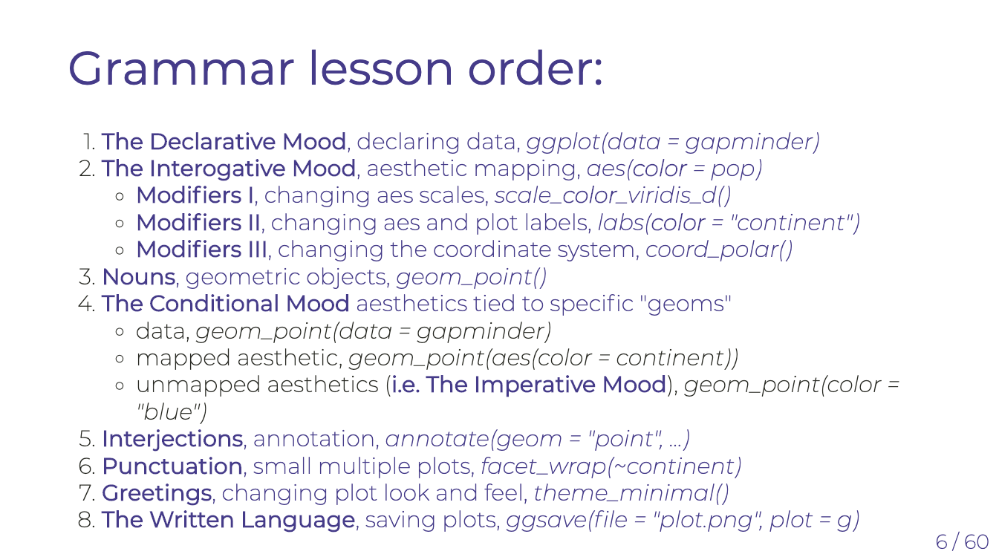
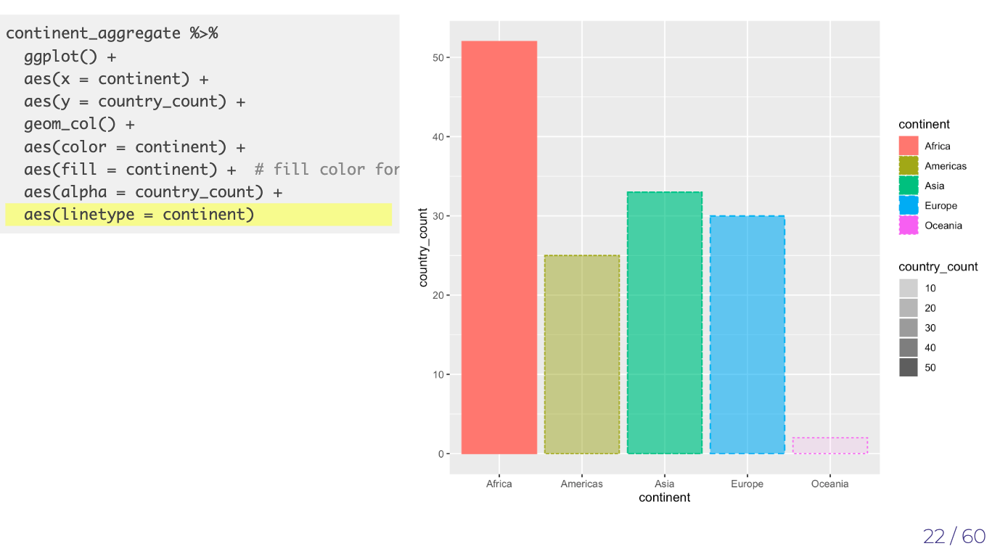
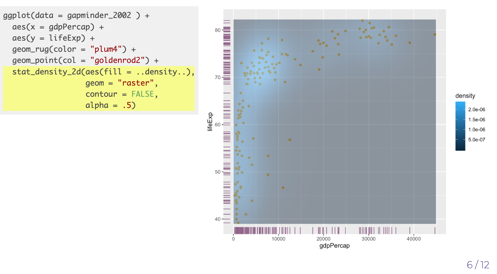
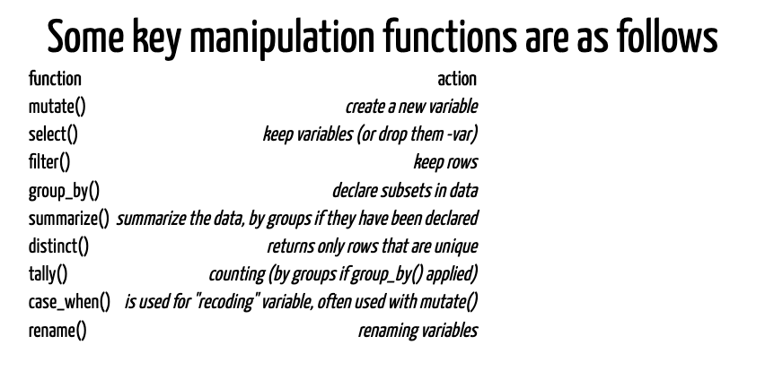
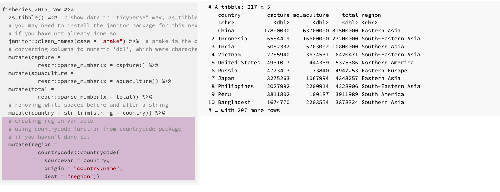
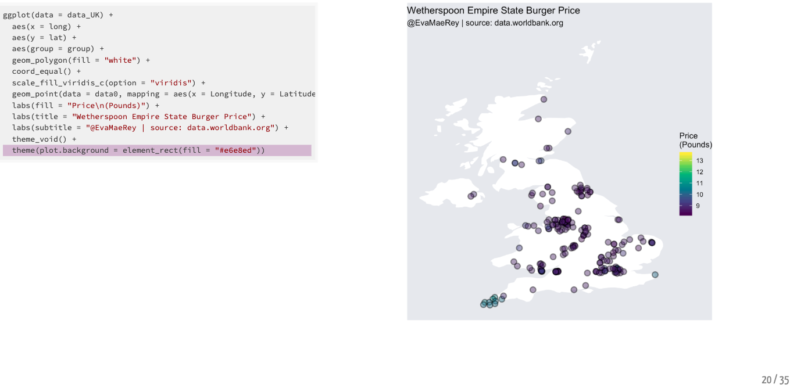
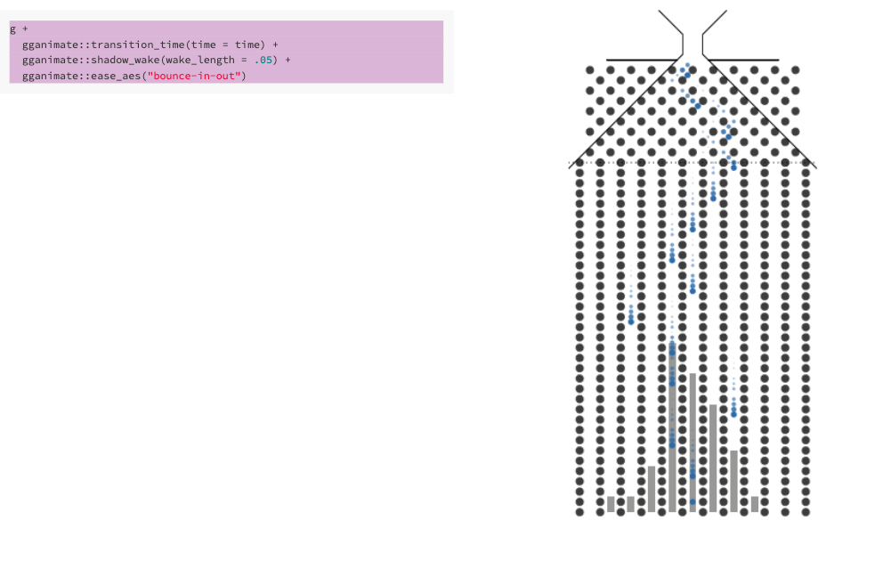
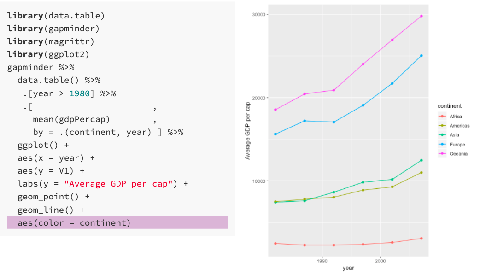
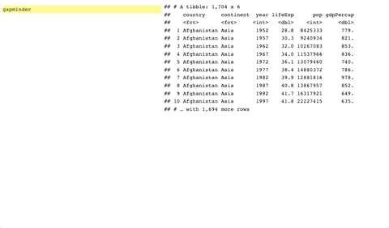

# Flipbooks


<!-- Original author is de:John Barnes Linnet - Zeitgenössische Illustration (1886), via de.wikipedia -->

*Flipbooks* present code step-by-step and side-by-side with its output.
The incremental code/result reveal may help you digest longer
manipulation and analysis pipelines as well as plot builds. Long
pipelines of code can produce attractive outputs. But they can feel like
long streches of *highway with no exit or entry ramps*. Interacting with
such code that has been made into a flipbook is different. The user can
isolate and gain insight about short streches along the pipeline that
are useful for her or his particular project – all the while engaged by
the creativity brought by the project creator in pursuit of their own
goal. Flipbooks enable us to isolate how individual functions work in
context.

### Example

Click once in the box the below to initiate the session; then use the
right and left arrow to “flip” through the book to see how to make an
animated “racing” bar chart of the population size of the most populous
countries over
time.

<iframe src="https://evamaerey.github.io/little_flipbooks_library/racing_bars/racing_barcharts.html#1" width="100%" height="400px">

</iframe>

## Do It Yourself

Would you like to make a flipbook? We try to make that easy for you with
{flipbookr}. To get started have a look at [A minimal
Flipbook](https://evamaerey.github.io/flipbooks/flipbookr/skeleton#1),
the template for which will be available once you install the [flipbooks
package](https://github.com/EvaMaeRey/flipbookr) as follows:

``` r
devtools::install_github("EvaMaeRey/flipbookr")
```

You will also likely use `xaringan`, an rmarkdown presentation builder:

``` r
install.packages("xaringan")
```

#### Steps to building your first flipbook using RStudio

1.  install.packages(“xaringan”)
2.  devtools::install\_github(“EvaMaeRey/flipbookr”)
3.  restart RStudio
4.  File -\> New File -\> RMarkdown -\> From Template -\> A Minimal
    Flipbook
5.  Use template or your own pipelines
6.  “Knit”
7.  Explore your flipbook\!

Using the steps above, the template will create the following book (you
can explore the different modalities
here):

<iframe src="https://evamaerey.github.io/little_flipbooks_library/flipbookr/skeleton#1" width="100%" height="400px">

</iframe>

#### But we’ve all got issues

Here are a few known issues to watch for:

1.  You will need an internet connection to build Xaringan output,
    unless you use this set up:
      - within a project execute xaringan::xaringan::summon\_remark() in
        your console
      - then in the YAML right after your css declaration, add, chakra:
        libs/remark-latest.min.js
2.  *Comments* in flipbooked pipelines should *not* contain parentheses
3.  Quoted text may not span lines (must be on a single line)
4.  Xaringan produces an html file and associated files. This means:
      - The output is not one, self-contained file
      - Output to be displayed in the flipbook must be supported in
        Xaringan and html

## Flipbooks built in-house

Here at the University of Denver, we’ve built a few flipbooks. Here are
some of them.

<div id="needtowrap">

If you need a theoretical exploration of the grammar of graphics and its
use with ggplot2, see [The ggplot2 grammar
guide](https://evamaerey.github.io/ggplot2_grammar_guide/ggplot2_grammar_guide).



<hr>

[The geom pile
on](https://evamaerey.github.io/ggplot2_grammar_guide/geoms.html) is a
suppliment to the ggplot grammar guide and shows you a lot of “geoms”
that you can use to communicate about your data. Piling up the geoms
allows you to see howing plot types relate to one
another.



<hr>

[ggplot
themes](https://evamaerey.github.io/flipbooks/taming_themes_in_ggplot/taming_ggplot_themes.html)
takes you through logic of the ggplot2 theme adjustments.

<hr>

For examples of data wrangling/manipulation with pipelines and pipes
(`%>%`), check out [The Tidyverse in
Action](https://evamaerey.github.io/tidyverse_in_action/tidyverse_in_action.html).



<hr>

[the data cleaning
flipbook](https://evamaerey.github.io/flipbooks/data_cleaning/data_cleaning)
gives you some life-changing, magical, and real-life examples of reading
data into R and cleaning it (aka “tidying up”). Demonstrates uses of
{janitor}, {countrycode}, and {lubridate} as well as regex with
{stringr}.



<hr>

[the ggplot
flipbook](https://evamaerey.github.io/ggplot_flipbook/ggplot_flipbook_xaringan.html)
walks through a variety of examples of plot built using
ggplot2.




<hr>

[Galton
Board](https://evamaerey.github.io/flipbooks/galton_board/galton_board.html#1)
shows you how to build your own Galton Board with R, ggplot2, and
gganimate.



<hr>

[leaflet for R (interactive
maps)](https://evamaerey.github.io/flipbooks/leaflet/leaflet#1) walk
through some interactive map builds using the {leaflet} package (load
slow\!).

<hr>

[the racing
barchart](https://evamaerey.github.io/flipbooks/racing_bars/racing_barcharts.html)
will give you a chance to flex your ggplot2 and gganimate muscles.


<hr>

  - [easing gallery for
    gganimate](https://evamaerey.github.io/easing_gganimate/easing_examples.html)

[D’Hondt/Jefferson
Allocation](https://evamaerey.github.io/flipbooks/dhondt_jefferson_allocation/dhondt_jefferson_allocation)
helps to explain just how seats are allocated under this common
political decision rule.


<hr>

[UNGA voting
data](https://evamaerey.github.io/flipbooks/unga_voting/unga_voting) is
a flipbook that looks at the number of votes taken in the UN General
Assembly. It also shows how you can make a lot of lateral moves and even
backward steps with your decisions in ggplot2 - like with facet\_null()
and overwriting aesthetic decisions with NULL - aes(color = NULL).


<hr>

[a data.table
flipbook](https://evamaerey.github.io/flipbooks/data.table/data.table)
is an introduction to the popular data manipulation package,
{data.table}.



<hr>

[\#TidyTuesday walk
through](https://evamaerey.github.io/tidytuesday_walk_through/tidytuesday_highlights.html)
showcases a few of the beautiful contributions to the \#TidyTuesday
initiative

<hr>

\[simpsona\]

<hr>

[Stacked Column -\> Pie
Chart](https://evamaerey.github.io/pie_chart/pie_chart.html) reveals
some of the deep logic of the grammar of graphics — Stacked column
plots, and pie plots and donut plots are related by choices in
coordinate systems and extent of axes.



</div>

## Implementation

If you are interested in contributing to {flipbookr}, you might consider
getting some of the intuition of the internal functions by browsing
through the resource below, or link to it
[here](https://evamaerey.github.io/little_flipbooks_library/flipbookr/flipbookr_building_blocks#1):

<iframe src="https://evamaerey.github.io/little_flipbooks_library/flipbookr/flipbookr_building_blocks#1" width="100%" height="400px">

</iframe>

## Origins

In mid 2018 Garrick Aden-Buie, a data scientist at the Moffitt Cancer
Center, created and debuted a side-by-side format for code and figure
output in the slide-show tool, Xaringan, an RMarkdown tool. He
demonstrated in incremental steps how someone might build up a plot
using the popular R visualization package ggplot2. In August 2018, I
emulated this work, but using a code style I developed which I called
“slowggplot2”, which is entirely sequential and more incremental than
typical workflows. This style uses one ggplot function for every
plotting decision that is made (when possible); this format is ideal for
automatically parsing and reconstructing partial builds of the plots;
reconstructions clearly connect the coding decision and associated
behavior. In September, Emi Tanaka, a Lecturer in Statistics at the
University of Sydney, implemented a similar sequential workflow
demonstration, which she partially automated.

I approached Garrick and Emi in October about working together on
“flipbooks”. We soon had a fully automated framework to parse ggplot2
code, and present the code reconstruction along with associated output\!

The procedure to automatically parse and reconstruct code was tested and
refined on small projects. Then, I created a “flipbook” of a sizable
collection of my portfolio of data visualizations, originally created
for the initiative \#MakeoverMonday. I publicized the work in February,
2019; *the ggplot flipbook* was met an enthusiastic reception.

Since then, I’ve taken the development lead in making a number of
changes to the foundational code to improve the tool and to extend use
cases. Many of these improvements are discussed in the template.

  - Adding more “connection” operators as break points for code (`%>%`,
    `->`, `%+%`) to enable presentation beyond data visualization
    (initially we only used the `+`)
  - Allowing code wrapping (breaks occur not necessarily at the end of
    lines)
  - Determining partial code completeness based on paretheses balancing
  - Using code parser rather than regular expressions to identify role
    of text segments
  - Allowing the user to define the reveal points (with the special
    `#BREAK` comment)
  - Allowing the user to define non-sequential reveal (with `#BREAK2`,
    `#BREAK3` etc)
  - Allowing code to be multiply revealed (multiple realizations of same
    code)
  - Allowing for output only or code only display (as opposed to just
    side by side)
  - Tracking objects created with left assignment
  - Separating the parsing, code reconstruction, and presentation
    platform delivery steps, to make code more flexible, and
robust.

<!-- https://www.garrickadenbuie.com/blog/decouple-code-and-output-in-xaringan-slides/ -->

<!-- https://emitanaka.rbind.io/post/knitr-knitr-code/ -->

## Reception

The feedback on the flipbook format has been very encouraging (thank you
if you were a part of this\!) and a big motivation to keep working on
this project. The ggplot flipbook was a [top story on Hacker
News](https://news.ycombinator.com/item?id=19356354) and was featured as
a highlight in the [R
Weekly](https://www.r-craft.org/r-news/r-weekly-2019-07-flipbook-package-building/)
newsletter.

Some of the most encouraging feedback about flipbooks has come from
individuals, via Twitter. Their comments can be viewed
[here](https://evamaerey.github.io/flipbooks/about/cheers_for_flipbooks).

Feedback comes from individuals around the world including the following
locations\!

Lincoln, NE | Ames IA | New York, NY | Los Angeles, CA | Louis, MO, USA
| London, England | st petersburg, fl | st petersburg, fl | Chapel Hill,
NC | Cambridge, MA | .uk | Rennes, France | Victoria, BC, Canada |
Christchurch City, New Zealand | Република Северна Македонија | Austin,
TX | Omaha, NE | Vancouver, British Columbia | Portland, OR | Raleigh ➡️
Houston | Strijtem, Flanders (Belgium) | São Paulo | Rotterdam, The
Netherlands | Utah, USA | Buenos Aires | Utah, USA | Chicago, IL |
España | Washington, DC | España | Chicago | Huntsville, AL | South
Africa | Aalborg, Denmark | Dresden, Germany | Orlando, FL |
Philadelphia, PA | Oslo, Norway | Helsinki, Finland | Rotterdam, The
Netherlands | UK | Montréal | Switzerland | Burlington, Vermont |
Montpellier, France | San Francisco, CA | San Francisco, CA | Hong Kong
| Fairfax, Virginia USA | Bundoora,Victoria, Australia | Ile-de-France,
France | Bundoora,Victoria, Australia | Chicago | Lansing, MI | Austin,
TX | Brooklyn, NY | United States | United Kingdom | Chicago |
Palmerston North, New Zealand | Coventry/Birmingham | Cambridge, MA |
Strasbourg, France | Sydney, New South Wales | RTP, NC | Tallahassee,
Florida, USA | Princeton, NJ | Nairobi, Kenya | Carrboro, NC | Yokohama
City Tsurumi Ward | Rio | Boston | Sheffield | ma | Germany | moon |
London, England | Lisbon, Portugal | Cambridge, MA | Ghana. | Vancouver,
BC | Santa Barbara, CA | Houston, TX | Waco, Texas | Victoria, British
Columbia | Austin, TX | Quincy, MA | Chicago, IL | Dallas, TX | Canada |
Utrecht | Paris, France | Philadelphia, PA | Sydney, New South Wales |
Toronto, Canada | Ho Chi Minh, Viet Nam | Lima, Peru | Aachen | Tilburg,
Nederland | Sydney | Waco, Texas | Melbourne, Victoria | roFL

<style type="text/css">
#needtowrap {
  -webkit-columns: 2;
  -moz-columns: 2;
  columns: 2;
}
#needtowrap p {
  margin: 0;
}
#needtowrap p + p {
  text-indent: 1em;
}

</style>
