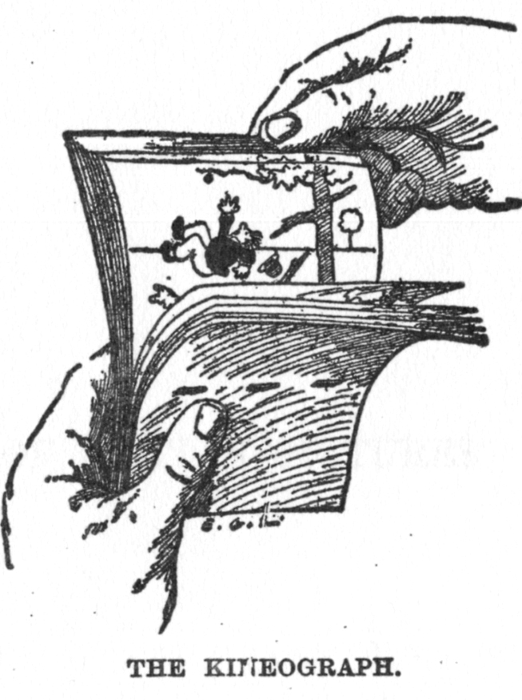

```{r setup, include = F}
knitr::opts_chunk$set(echo = F, message = F, fig.align = "center")
```





<!-- Original author is de:John Barnes Linnet - Zeitgenössische Illustration (1886), via de.wikipedia -->
*Gina Reynolds, February 2020*

# Flipbooks

*Flipbooks* present code step-by-step and side-by-side with its output. The incremental code/result reveal may help you digest longer manipulation and analysis pipelines as well as plot builds.  Two of their attractive features are incrementalism and movie-like presentation.  

### Incrementalism

Long pipelines of code can produce attractive outputs.  But when an observer knows only initial input and final output, a pipeline may feel like a long stretch of highway that has *no exit or entry ramps*.   Interacting with the same code that has been made into a flipbook is designed to give users a lot of entry and exit ramps; in a flipbook the user can isolate and gain insight about *short streches* along the pipeline that are useful for their particular project -- all the while engaged by the creativity brought by the author in pursuit of their original goal.  Flipbooks enable us to isolate how individual functions work *in context*.   

### Movie-like presentation

The presentation of intermediate states on via *slide-show presentation*  platform means that states can be aligned and superimposed.  This way, the audience doesn't need to engage in *visual search* which requires focus and concentration -- but rather effortlessly observes changes as *motion detection*.  Temporal rather than spatial offset makes it easy to notice changes to the code and the resultant changes to the output. 

To get a sense of how they work, click once in the example box the below to initiate the session; then use the right and left arrow to "flip" through the book to see how to make an animated "racing" bar chart of the population size of the most populous countries over time.   

```{r}
knitr::include_url("https://evamaerey.github.io/flipbooks/racing_bars/racing_barcharts.html#1")
```


## Flipbook Topics

For easier reference, I've sorted instructive flipooks into three main categories. You can link to guides to further subtopics here:  


<a href="https://evamaerey.github.io/data_manipulation/about" class="button">Data Wrangling</a>
<a href="https://evamaerey.github.io/ggplot2_grammar_guide/about" class="button">Data Visualization with ggplot2</a>
<a href="https://evamaerey.github.io/statistics/about" class="button">Statistical Analysis</a>


Mostly, I've created these resources while preparing for my classes at the Korbel School of Internationl Studies at the University of Denver.  So many thanks due to my students for being such an amazing and motivating bunch. These repositories are under construction; the data wrangling topic and data visualization topics are taking shape and fairly well developed, while the statistical flipbooks are new and more experimental. 

```{css}
.button {
  background-color: #4682b4; /* Blue */
  border: none;
  color: white;
  padding: 15px 32px;
  text-align: center;
  text-decoration: none;
  display: inline-block;
  font-size: 16px;
}
```


## Create *your own* flipbook

Would you like to make a flipbook? We try to make that easy for you with {flipbookr}. To get started have a look at [A minimal Flipbook](https://evamaerey.github.io/flipbooks/flipbookr/skeleton#1){target="_blank"}, the template for which will be available once you install the flipbook building package [{flipbookr}](https://github.com/EvaMaeRey/flipbookr){target="_blank"}.  The steps to building your first flipbook are as follows:

1. Install the slide show platform Xaringan - `install.packages("xaringan")` 
2. Install flipbookr - `remotes::install_github("EvaMaeRey/flipbookr")` 
3. restart RStudio
4. Get the template via: File -> New File -> RMarkdown -> From Template -> A Minimal Flipbook
5. Use this template to get started or replace with your own pipelines
6. Compile your document - "Knit" in RStudio
7. Explore your flipbook!


Once you have completed steps 1-3, you can also follow along with the [live demo](https://resources.rstudio.com/rstudio-conf-2020/flipbooks-evangeline-reynolds) that I presented at the RStudio Conference, 2020 (the demo is at 6'25") --- but consider using the setup code chunk in the template --- I don't do this in the demo. 

The template (step 4) will create the following book, which contains examples of flipbooking modes:

```{r}
knitr::include_url("https://evamaerey.github.io/flipbooks/flipbookr/skeleton")
```

#### But we've all got issues

Here are a few known issues to watch for:

1. You will need an internet connection to build Xaringan output, unless you use this set up:
    - within a project execute xaringan::xaringan::summon_remark() in your console 
    - then in the YAML right after your css declaration, add, chakra: libs/remark-latest.min.js
2. *Comments* in flipbooked pipelines should *not* contain parentheses
3. Quoted text may not span lines (quoted text must be on a single line)
4. Xaringan produces an html file and associated files.  This means:
    - The output is not one, self-contained file
    - Output to be displayed in the flipbook must be supported in Xaringan and html


#### Contributing Feedback

You can contribute feedback via Twitter @EvaMaeRey and via isses on [Github.com/EvaMaeRey/flipbookr](https://github.com/EvaMaeRey/flipbookr).

## Implementation

If you are interested in contributing to {flipbookr}, you might consider getting some of the intuition of the internal functions by browsing through the resource below, or link to it  [here](https://evamaerey.github.io/little_flipbooks_library/flipbookr/flipbookr_building_blocks#1){target="_blank"}:

```{r}
knitr::include_url("https://evamaerey.github.io/flipbooks/flipbookr/flipbookr_building_blocks#1")
```


## Origins

In mid 2018 Garrick Aden-Buie, a data scientist at the Moffitt Cancer Center, created and debuted a [side-by-side format](https://www.garrickadenbuie.com/blog/decouple-code-and-output-in-xaringan-slides/) for code and figure output in the slide-show tool, Xaringan, an RMarkdown tool.  He demonstrated in incremental steps how someone might build up a plot using the popular R visualization package ggplot2.  In August 2018, I emulated this work, but using a code style I developed which I called "slowggplot2", which is entirely sequential and more incremental than typical workflows. This style uses one ggplot function for every plotting decision that is made (when possible); this format is ideal for automatically parsing and reconstructing partial builds of the plots; and reconstructions clearly connect the coding decision and associated behavior because differences between states is small.  In September, Emi Tanaka, a Lecturer in Statistics at the University of Sydney, implemented a similar sequential workflow demonstration, [which she partially automated](https://emitanaka.rbind.io/post/knitr-knitr-code/).  

I approached Garrick and Emi in October about working together on "flipbooks".  We soon had a fully automated framework to parse ggplot2 code, and present the code reconstruction along with associated output!  

The procedure to automatically parse and reconstruct code was tested and refined on small projects.  Then, I created a "flipbook" of a sizable collection of my portfolio of data visualizations, originally created for the initiative #MakeoverMonday.  I publicized the work in February, 2019; *the ggplot flipbook* was met an enthusiastic reception.  

Since then, there have been a number of changes to the foundational code to improve the tool and to extend use cases. Many of the capabilities that have been added are also discussed in the template. 

- Adding more "connection" operators as break points for code (`%>%`, `->`, `%+%`, `%$%`) to enable presentation beyond data visualization (initially we only used the `+`)
- Allowing code wrapping (breaks occur not necessarily at the end of lines) 
- Determining partial code completeness based on parentheses balancing 
- Using code parser rather than regular expressions to identify role of text segments 
- Allowing the user to define the reveal points (with the special `#BREAK` comment)
- Allowing the user to define non-sequential reveal (with `#BREAK2`, `#BREAK3` etc)
- Allowing code to be multiply revealed (multiple realizations of same code)
- Allowing for output only or code only display (as opposed to just side by side)
- Tracking objects created with left assignment
- Separating the parsing, code reconstruction, and presentation platform delivery steps, to make code more flexible, and robust.  

<!-- https://www.garrickadenbuie.com/blog/decouple-code-and-output-in-xaringan-slides/ -->
<!-- https://emitanaka.rbind.io/post/knitr-knitr-code/ -->


## Featured examples

You can link some flipbooks here: 


```{r, child="flipbook_examples.Rmd"}
```


## Reception

The feedback on the flipbook format has been very encouraging (thank you if you were a part of this!) and a big motivation to keep working on this project.  The ggplot flipbook was a top story on [Hacker News](https://news.ycombinator.com/item?id=19356354) and was featured as a highlight in the [R Weekly](https://www.r-craft.org/r-news/r-weekly-2019-07-flipbook-package-building/) newsletter. 


Some of the most encouraging feedback about flipbooks has come from individuals, via Twitter.  Their comments can be viewed [here](https://evamaerey.github.io/flipbooks/about/cheers_for_flipbooks).

Feedback comes from individuals around the world including the following locations!

```{r, results='asis', eval = T}
library(tidyverse)
load("about/data_products/tweets.Rdata")
df %>% 
  select(location) %>% 
  drop_na() %>% 
  filter(!str_detect(location, "^MS student|^Passion|^she|^Data")) %>% 
  pull(location) %>% 
  cat(sep = " | ")
```

# Acknowledgements

Flipbooks are inspired and enabled by the step-by-step workflow of ggplot2 and piped workflows enabled by the magrittr package (especially dplyr) and the knitr/rmarkdown communication tools.  Specifically, the rmarkdown slide show presentation tool {xaringan} is used to present the code movies; xaringan is built on [remark.js](https://yihui.org/en/2017/08/why-xaringan-remark-js/).  

Emi Tanaka and Garrick Aden Buie are due enormous thanks for their contributions to getting this project off the ground.  There are numerous other influences, inspirations, and helps for which I'm grateful and which have made the project possible!


