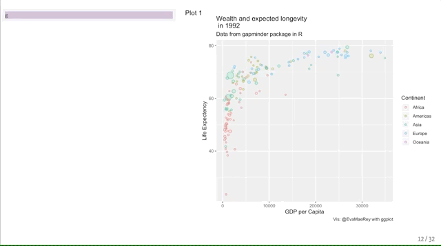
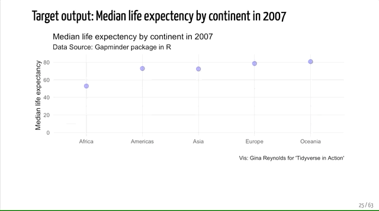
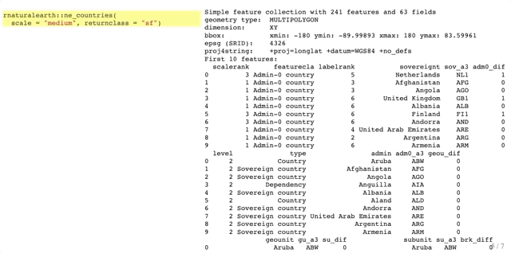
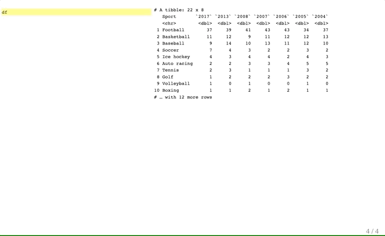
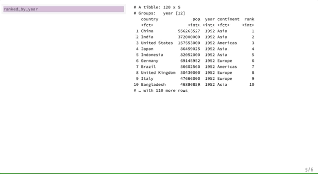
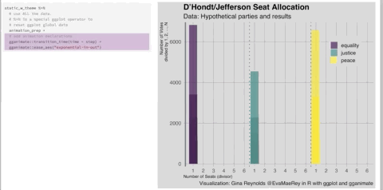
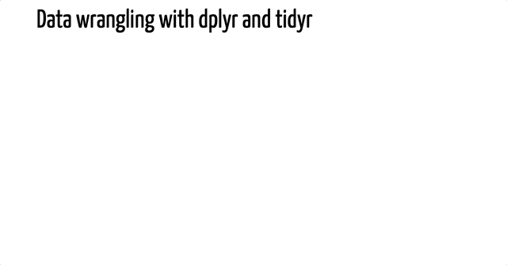
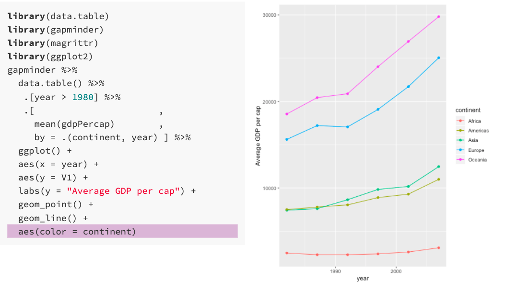
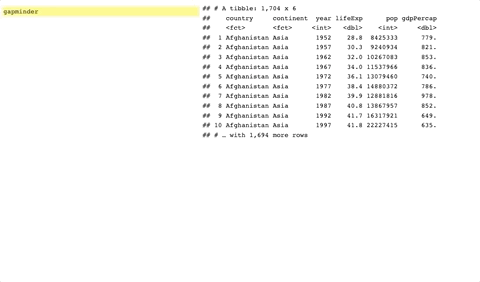

<!-- add simpsons -->

<div id="needtowrap">

If you need a theoretical exploration of the grammar of graphics and its use with ggplot2, see [a ggplot2 grammar guide](https://evamaerey.github.io/ggplot2_grammar_guide/ggplot2_grammar_guide){target="_blank"}.

```{r, out.width="85%", fig.align='center', echo = F}
knitr::include_graphics(c("figures/column_aesthetics.png"))
```

<hr>

[The geom pile on](https://evamaerey.github.io/ggplot2_grammar_guide/geoms.html){target="_blank"} is a suppliment to the ggplot grammar guide and shows you a lot of "geoms" that you can use to communicate about your data.  Piling up the geoms allows you to see how plot types relate to one another. 


```{r, out.width="85%", fig.align='center', echo = F}
knitr::include_graphics(c("figures/geom_pile_on.gif"))
```

<hr>

[ggplot themes](https://evamaerey.github.io/flipbooks/taming_themes_in_ggplot/taming_ggplot_themes.html){target="_blank"} takes you through 
logic of the ggplot2 theme adjustments.

```{r, out.width="85%", fig.align='center', echo = F}

```

<hr>

For examples of data wrangling/manipulation with pipelines and pipes (`%>%`), check out [The Tidyverse in Action](https://evamaerey.github.io/tidyverse_in_action/about.html){target="_blank"}.


```{r, out.width="85%", fig.align='center', echo = F}

```

<hr>

[geom_sf](https://evamaerey.github.io/flipbooks/geom_sf/geom_sf.html){target="_blank"} gives you an example of using geom_sf with ggplot to create coordinate plots and choropleths.

```{r, out.width="85%", fig.align='center', echo = F}

```


<hr>

[ggtext](https://evamaerey.github.io/flipbooks/ggtext/ggtext.html){target="_blank"} gives you an example of the 
how the new ggtext package can be used; this example by Klaus Schulte.

```{r, out.width="85%", fig.align='center', echo = F}

```

<hr>

[the data cleaning flipbook](https://evamaerey.github.io/flipbooks/data_cleaning/data_cleaning){target="_blank"} gives you some life-changing, magical, and real-life examples of reading data into R and cleaning it (aka "tidying up").  Demonstrates uses of {janitor}, {countrycode}, and {lubridate} as well as regex with {stringr}.


```{r, out.width="85%", fig.align='center', echo = F}
knitr::include_graphics(c("figures/data_cleaning_flipbook1.png"))
```
<hr>

[the ggplot flipbook](https://evamaerey.github.io/ggplot_flipbook/ggplot_flipbook_xaringan.html){target="_blank"} is a gallery example plots built using ggplot2.

```{r, out.width="85%", fig.align='center', echo = F}

```

<hr>

[Galton Board](https://evamaerey.github.io/flipbooks/statistics/galton_board.html#1){target="_blank"} shows you how to build your own Galton Board with R, ggplot2, and gganimate.

```{r, out.width="85%", fig.align='center', echo = F}
knitr::include_graphics("figures/galton_board.gif")
```
<hr>

[leaflet for R (interactive maps)](https://evamaerey.github.io/flipbooks/leaflet/leaflet#1){target="_blank"} walk through some interactive map builds using the {leaflet} package (loads slow!).

<hr>

[the racing barchart](https://evamaerey.github.io/flipbooks/racing_bars/racing_barcharts.html){target="_blank"} will give you a chance to flex your ggplot2 and gganimate muscles.

```{r, out.width="85%", fig.align='center', echo = F}

```
<hr>

- [easing gallery for gganimate](https://evamaerey.github.io/easing_gganimate/easing_examples.html){target="_blank"}


[D’Hondt/Jefferson Allocation](https://evamaerey.github.io/flipbooks/dhondt_jefferson_allocation/dhondt_jefferson_allocation){target="_blank"} helps to explain just how seats are allocated under this common political decision rule.

```{r, out.width="85%", fig.align='center', echo = F}

```
<hr>


[UNGA voting data](https://evamaerey.github.io/flipbooks/ggplot2_grammar_guide/unga_voting) is a flipbook that looks at the number of votes taken in the UN General Assembly.  It also shows how you can make a lot of lateral moves and even backward steps with your decisions in ggplot2 - like with facet_null() and overwriting aesthetic decisions with NULL - aes(color = NULL).


```{r, out.width="85%", fig.align='center', echo = F}

```

<hr>

[a data.table flipbook](https://evamaerey.github.io/flipbooks/data.table/data.table){target="_blank"} is an introduction to the popular data manipulation package, {data.table}.

```{r, out.width="85%", fig.align='center', echo = F}

```
<hr>

[#TidyTuesday walk through](https://evamaerey.github.io/tidytuesday_walk_through/tidytuesday_highlights.html){target="_blank"} showcases a few of the beautiful contributions to the #TidyTuesday initiative


<hr>

[Stacked Column -> Pie Chart](https://evamaerey.github.io/pie_chart/pie_chart.html){target="_blank"} reveals some of the deep logic of the grammar of graphics --- Stacked column plots, and pie plots and donut plots are related by choices in coordinate systems and extent of axes. 


```{r, out.width="85%", fig.align='center', echo=F}

```


</div>


```{css, echo = F}
#needtowrap {
  -webkit-columns: 3;
  -moz-columns: 3;
  columns: 3;
}
#needtowrap p {
  margin: 0;
}
#needtowrap p + p {
  text-indent: 1em;
}

```
