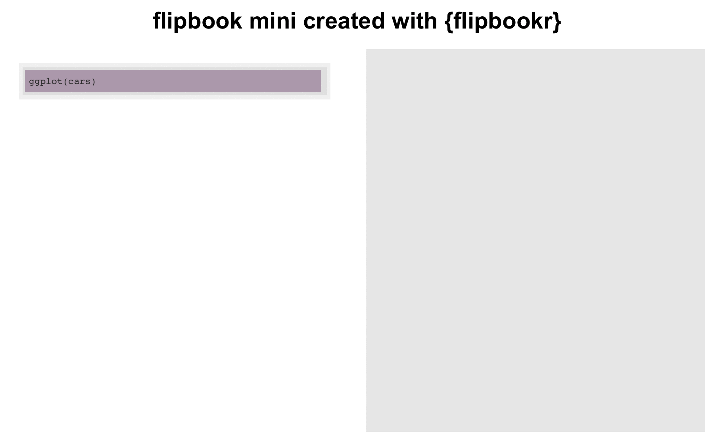

```{r}
library(tidyverse)
library(flipbookr)
```


```{r just_for_evamaerey, cache = FALSE, echo = FALSE}
try(source("R/base_parse_reveal_xaringan.R"))
try(source("R/mini.R"))
```

# Flipbook Mini - only plots supported by cowplot...

We're using a delivery system of the composed cowplot. Experimental!

```{r mini}
ggplot(cars) +
  aes(x = speed) +
  aes(y = dist) +
  geom_point() +
  aes(color = speed) +
  scale_color_viridis_c() +
  theme_minimal() +
  theme(legend.position = c(.07, .7)) +
  theme(legend.background = element_rect(fill = "white")) +
  theme(legend.background = element_rect(color = "grey96")) +
  theme(panel.grid.minor = element_blank()) +
  theme(panel.grid.major = element_line(color = "grey96")) +
  theme(text = element_text(color = "grey20"))
```

```{r}
chunk_code_get("mini") %>% 
  code_create_gif_flipbook()

```
